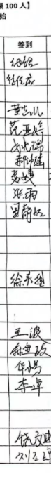

<h3 style="font-family: 'Arial', sans-serif; color: red;">介绍：党团研活动审核辅助页面</h3>

来不及部署了hh，请自己取用体验吧
git项目到本地后,分别开启前端和后端
对于后端：
```shell
先进入目录：
cd auto-audit-api
先安装必要的react项目依赖，在终端中执行：
npm i
然后启动后端
npm start
一般默认3000端口
```
对于前端
```shell
先进入目录：
cd auto-audit-front
先安装必要的react项目依赖，在终端中执行：
npm i
然后启动后端
npm start
因为3000端口被占用，输入y确认选择另外一个端口，一般默认3001端口
```
然后以党团研的账号登录即可，进入 http://localhost:3001/ 这个页面，
#### 提示
==1、代码比较粗糙，随时保持更新，而且用为采用ocr识别，请只上传参与了活动部分的同学的图片==，比如：

2、如果识别失败就多点几次**一键审核**
3、如果提示获取数据失败，就刷新重新登录进入

